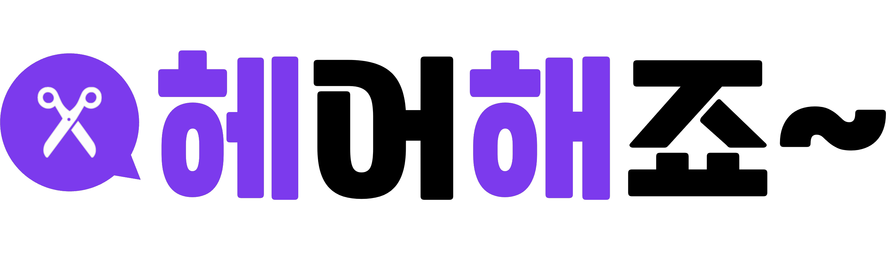

* [헤어해죠~ 바로가기](https://hairhaejo.site/)
* [소프트콘 소개 페이지](https://softcon.ajou.ac.kr/works/works.asp?uid=832&category=S)

## 📚 기술 스택

 

  

   

* React
  - Virtual Dom을 통해 실제 DOM과 비교해서 달라진 부분만 찾아 빠르게 바꾸며 component 단위의 개발이 가능한 특징이 있다. 또한, component들을 나누어 놓았기 때문에 재사용이 가능하여 생산성과 유지 보수를 용이하게 하기 때문에 선택했다.

* React Native
  - 모바일 앱 개발을 위한 Javascript 기반 프레임워크이다. 하나의 코드로 android와 ios 앱 모두를 개발할 수 있으며, 웹 프론트엔드 개발 시 react를 사용하기 때문에 선택했다.
  - 헤어해죠는 주로 React를 사용해 개발한 웹 페이지를 웹 뷰를 통해 앱의 형태로도 제공할 수 있도록 제작하기 위해 사용했다.

* Redux Toolkit
  - 전역 상태 관리를 위해 사용했다.

* Tailwind CSS
  - 모든 컴포넌트의 CSS 스타일링을 용이하게 하기 위해 사용했다.

* Chart.js
  - CRM 페이지에서 헤어 디자이너에게 각종 통계 정보를 그래프 형태로 제공하기 위해 사용했다.

* Github Action
  - CI/CD 구축을 통해 자동으로 프로젝트의 빌드 및 배포를 손쉽게 하기 위해 사용했다.

* Amazon EC2
  - 프로젝트 배포를 위해 클라우드 환경의 Amazon EC2를 사용했다.

* Nginx
  - 프로젝트 배포 및 서버 환경 구축을 위해 사용했다. 가볍고 높은 성능 때문에 선택했다.

## ✔️ 간략한 구현 설명

#### '헤어해죠~'에서 볼 수 있는 주요 기능들을 알아보기 쉽게 설명하기 위해 각 페이지별로 확인할 수 있는 부분들을 언급하고자 한다.

### Landing Page
 |
--- | --- | 

    - 헤어해죠~에 접속하면 처음 등장하는 페이지이다.
    - 예시로 대표 이용자들의 간단한 사용 후기 확인이 가능하다.
    
### Signup Page
 |
--- | --- | 

    - 인적 사항과 이메일/비밀번호 등을 입력해 회원 가입을 진행한다.
    - 인증을 위해 이메일 인증을 진행한다.
    - 고객은 자신의 프로필에 주소지, 성별, 연령, 모발 상태 등을 설정한다.
    - 헤어 디자이너는 업체 정보와 사업자 등록증을 업로드한다.
    
### Login Page
 |
--- | --- | 

    - 이메일과 비밀번호를 입력해 로그인한다.
    - 비밀번호를 잊었을 경우에 이메일을 통해 비밀번호를 찾을 수 있다.
    - 접속이 끊어져도 2시간동안 자동 로그인, 로그인 유지가 가능하다. (로그아웃시, 해제)
    
### Matching Page
    - 매칭은 크게 일반 매칭과 빠른 매칭으로 나뉜다.
   
  #### 일반 매칭 (상담 요청 글 / 디자이너가 고객에게 접근)
   |
--- | --- | 

    - 고객은 원하는 지역, 현재 헤어 스타일과 원하는 헤어 스타일 사진, 카테고리 및 태그를 설정하고 추가 설명을 첨부해 상담 요청 글을 작성한다.
    - 고객은 상담 요청 글을 수정/삭제할 수 있다.
    - 헤어 디자이너는 카테고리로 필터링하거나 키워드 검색을 통해 고객의 요청 글을 조회한다.
    - 헤어 디자이너는 고객의 요청 글과 프로필을 보고 상담 메시지를 전송할 수 있다.
        
  #### 빠른 매칭 (포트폴리오, 디자이너 추천 / 고객이 디자이너에게 접근)
   |
--- | --- | 

    - 고객은 카테고리와 지역을 설정해 여러 디자이너들의 포트폴리오를 조회한다.
    - 고객은 헤어 디자이너 추천을 원한다면, 디자이너 추천 탭을 선택한다.
    - 포트폴리오 또는 추천 디자이너 목록을 확인하고 원하는 디자이너에게 상담 메시지를 전송한다.
    - 포트폴리오 또는 추천 디자이너 목록을 확인하고 원하는 디자이너에게 바로 예약을 진행한다.
    
### Chatting Page
 |
--- | --- | 

    - 서로 상대의 프로필 사진을 클릭해 프로필과 포트폴리오를 확인할 수 있다.
    - 텍스트 또는 이미지를 통해 실시간 채팅으로 상담을 진행한다.
    - 원한다면, 바로 전화 상담도 가능하다.
    - 채팅방을 나가 상담을 중단할 수도 있다.
    - 새로운 채팅에 대한 푸시 알람을 받을 수 있다.

### Reservation Page
 |
--- | --- | 
 
    - 고객은 상담 후에 헤어 디자이너가 마음에 들면 예약을 진행한다.
    - 고객은 헤어 디자이너의 일정 중 빈 날짜와 시간을 확인한다.
    - 고객은 원하는 시간과 진행할 시술을 선택한다.
    - 고객은 카카오페이 결제를 진행하여 예약을 완료한다.
    - 고객은 결제 및 예약 완료 후, 카카오톡 알림을 통해 결제 내역을 확인할 수 있다.
    - 고객은 마이페이지에서 예약 목록을 확인한다.
    - 고객은 마이페이지에서 예약 취소 및 환불을 진행할 수 있다.
    
### My Page
 |
--- | --- | 

    - 프로필 및 계정 정보를 확인한다.
    - 프로필 및 계정 정보를 변경할 수 있다.
    - 헤어 디자이너는 포트폴리오를 추가할 수 있다.
    - 헤어 디자이너는 자신의 메뉴를 추가할 수 있다.
    - 고객은 관심 디자이너를 추가할 수 있다. (즐겨찾기)
    - 고객과 디자이너 모두 자신의 예약 목록을 확인할 수 있다.
    - 사용자는 회원 탈퇴를 할 수 있다.
    
 ### CRM Page
 |
--- | --- | 

    - 헤어 디자이너는 방문 고객 기록을 조회한다.
    - 헤어 디자이너는 각 고객의 프로필 확인할 수 있다.
    - 헤어 디자이너는 각 고객에게 상담 메시지를 전송할 수 있다.
    - 헤어 디자이너는 각 고객에 대한 메모를 확인할 수 있다.
    - 헤어 디자이너는 각 고객에 대한 메모를 추가 및 삭제할 수 있다.
    - 헤어 디자이너는 휴일을 설정할 수 있다. (등록된 휴일은 예약 불가능)

    - 헤어 디자이너는 월 별 시술 수, 매출 통계를 확인할 수 있다.
    - 헤어 디자이너는 성별 별 시술 수, 매출 통계를 확인할 수 있다.
    - 헤어 디자이너는 연령대 별 시술 수, 매출 통계를 확인할 수 있다.
    - 헤어 디자이너는 메뉴 별 시술 수, 매출 통계를 확인할 수 있다.
    - 헤어 디자이너는 기존/신규 고객 별 시술 수, 매출 통계를 확인할 수 있다.
    - 각 통계를 막대 그래프, 선 그래프, 파이 차트로 확인할 수 있다.

### AdminPage
 |
--- | --- | 

    - 관리자는 헤어 디자이너의 가입 요청을 조회한다.
    - 관리자는 헤어 디자이너가 업로드한 사업자 등록증을 검토하고 가입을 승인 또는 거절한다.

    - 관리자는 부적절한 요청 글, 후기 신고 내역을 조회한다.
    - 관리자는 신고를 검토하고 글 또는 후기를 삭제할 수 있다.
    - 관리자는 신고를 검토하고 이용자를 정지 시킬 수 있다.

### 🕹️ 코딩 컨벤션

  - 컴포넌트는 일반 함수형 `function component() {}`과 같이 선언한다.
  - 함수 naming은 camelCase를 이용해 최대한 동사로 작성한다.
  - 컴포넌트 내부 함수는 화살표 함수(arrow function) 형태 `const getName = () => {}`과 같이 선언한다.
  - 변수 naming은 camelCase를 이용해 최대한 명사로 작성한다.
  - state 선언의 경우 반드시 [name, setName] 형식을 따른다.
